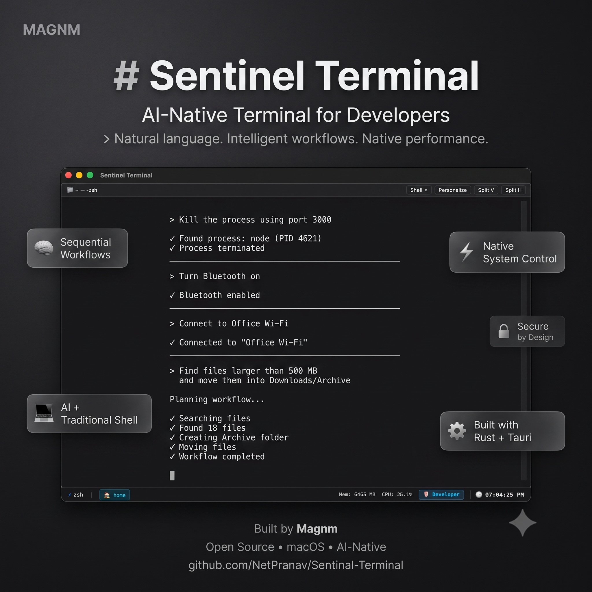

# Sentinel Terminal Website

<p align="center">
  
</p>

<p align="center">
  <strong>The official landing page for Sentinel Terminal.</strong>
</p>

<p align="center">
  Showcasing the vision, features, documentation, and open-source community behind Sentinel Terminal.
</p>

---

## About

This repository contains the source code for the **official Sentinel Terminal website**.

The website serves as the primary entry point for developers, contributors, and users interested in Sentinel Terminal.

It is designed to provide a polished product experience while directing users to the main open-source project, documentation, releases, and community resources.

> **Note**
>
> This repository only contains the website.
> The Sentinel Terminal application is developed in a separate repository.

---

## Website Features

- Modern responsive landing page
- Product overview
- Feature showcase
- Screenshots
- Installation guides
- Documentation links
- GitHub integration
- Release information
- Community & contribution links
- Contact information

---

## Purpose

The website is intended to:

- Introduce Sentinel Terminal
- Explain what the project is
- Showcase product capabilities
- Provide installation instructions
- Redirect users to the main GitHub repository
- Help onboard new contributors
- Act as the public face of the Sentinel ecosystem

---

## Tech Stack

- React
- Next.js
- TypeScript
- Tailwind CSS
- Framer Motion
- Vercel

---

## Local Development

Clone the repository

```bash
git clone <repository-url>
```

Install dependencies

```bash
npm install
```

Start the development server

```bash
npm run dev
```

Build for production

```bash
npm run build
```

---

## Contributing

We welcome contributions from the community.

You can help by:

- Improving the UI/UX
- Fixing bugs
- Optimizing performance
- Improving accessibility
- Enhancing animations
- Improving documentation
- Suggesting new sections

Before making large changes, please open an issue to discuss your proposal.

---

## Reporting Issues

If you discover a problem with the website, please create an Issue in this repository.

For issues related to the Sentinel Terminal application itself, please use the main Sentinel repository.

---

## Project Structure

```text
src/
components/
public/
app/
styles/
hooks/
lib/
```

---

## About Sentinel Terminal

Sentinel Terminal is an AI-native terminal that combines natural language understanding, intelligent workflow execution, and secure operating system capabilities into a modern developer experience.

Unlike traditional terminals that only execute commands, Sentinel understands intent and can perform multi-step workflows while maintaining transparency and developer control.

---

## About Magnm

Sentinel Terminal is being built under **Magnm**, an open-source initiative focused on building modern AI-powered developer tools.

---

## Community

Website Issues:
https://github.com/adarzhpathade/sentinal-landing-page.git

Application:
https://github.com/NetPranav/Sentinel-Terminal

---

## License

This project is licensed under the same license as the Sentinel ecosystem.

See the LICENSE file for details.

---

<p align="center">
Built with ❤️ by Magnm
</p>
